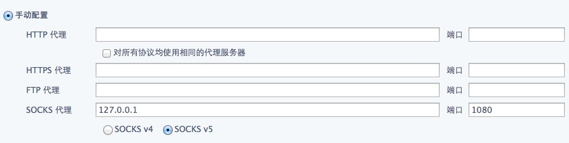

# 科学上网

1. [下载Chrome扩展](./Proxy-SwitchySharp_v1.10.4.crx)

1. [使用Chrome浏览器点击这里](chrome://extensions/)

1. 拖动下载的文件到扩展程序页面来安装，需要先勾选上 "开发者模式"

1. [进入配置页面](chrome-extension://dpplabbmogkhghncfbfdeeokoefdjegm/options.html)


1. 看下图填空：
```
SOCKS代理地址 192.168.0.120
端口 1080

下面选择 SOCKS v5
```
1. 


## 去掉Google搜索结果里的URL跳转
### Google Chrome浏览器配置
1. 安装chrome扩展NOScript：https://chrome.google.com/extensions/detail/odjhifogjcknibkahlpidmdajjpkkcfn

1. 修改密码：

    Windows XP:   %userprofile%\Local Settings\Application Data\Google\Chrome\User Data\Default\Extensions\odjhifogjcknibkahlpidmdajjpkkcfn
    Windows Vista or 7:   %userprofile%\AppData\Local\Google\Chrome\User Data\Default\Extensions\odjhifogjcknibkahlpidmdajjpkkcfn
    Mac OS X:   ~/Library/Application Support/Google/Chrome/Default/Extensions/odjhifogjcknibkahlpidmdajjpkkcfn
    Linux:   ~/.config/google-chrome/Default/Extensions/odjhifogjcknibkahlpidmdajjpkkcfn

找到了`CHANGE__PASSWORD__HERE.js`该文件之后，然后右击使用记事本或者其他的文本编辑工具来编辑，填写你想要保存的密码字符，注意密码字符最短20个，最长100个，你只需要在`const ENCRYPTION_PASSWORD = "";`的引号当中输入字符保存即可。

1. 重启Chrome即可

### Safari浏览器配置

[gDirectLinks](http://dl.dropbox.com/u/23990/Canisbos/gDirectLinks.safariextz)


# 参考
http://www.v2ex.com/t/22335
